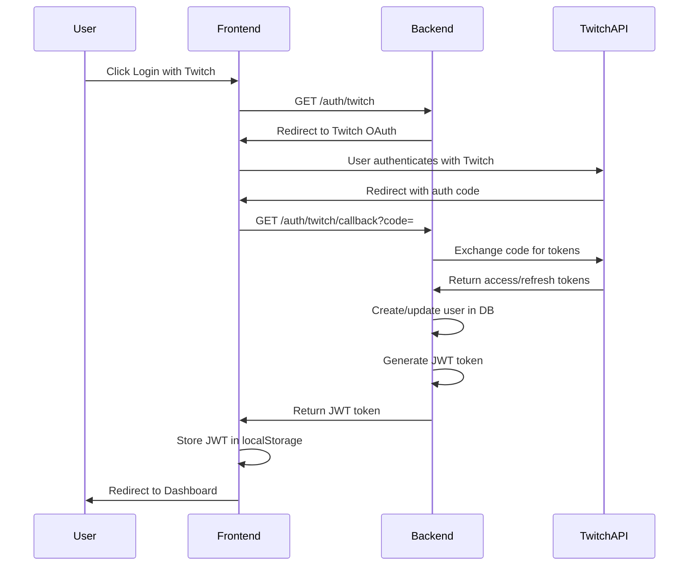
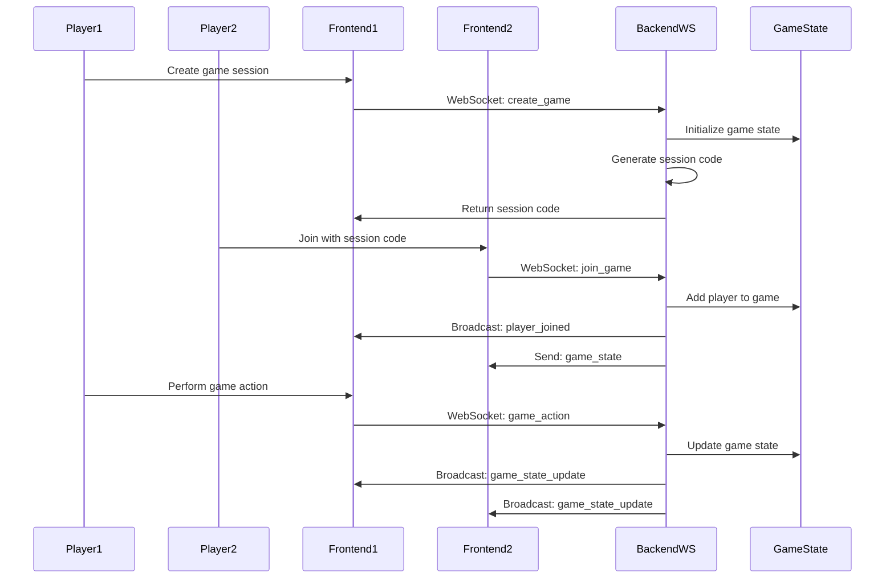
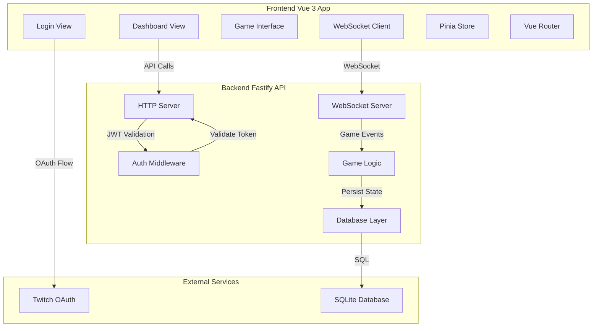
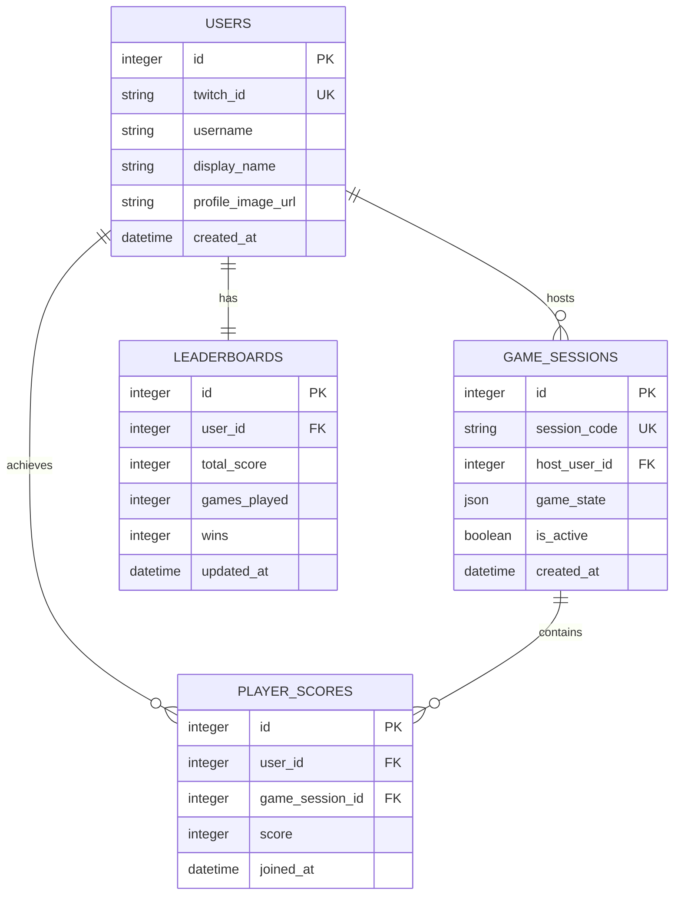

# System Architecture Diagram

## Authentication Flow


## WebSocket Game Flow


## System Architecture


## Database Relationships


## Component Structure
```mermaid
graph LR
    subgraph "Frontend Components"
        Login[Login.vue]
        Dashboard[Dashboard.vue]
        GameLobby[GameLobby.vue]
        GameBoard[GameBoard.vue]
        Chat[ChatComponent.vue]
        Leaderboard[LeaderboardComponent.vue]
    end
    
    subgraph "Backend Modules"
        Auth[Auth Module]
        WebSocket[WebSocket Module]
        Game[Game Module]
        Database[Database Module]
    end
    
    Login --> Auth
    Dashboard --> Game
    GameBoard --> WebSocket
    Chat --> WebSocket
    Leaderboard --> Database